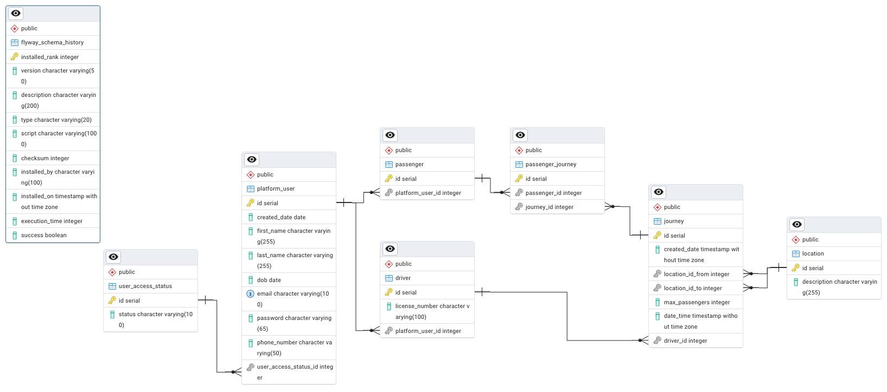
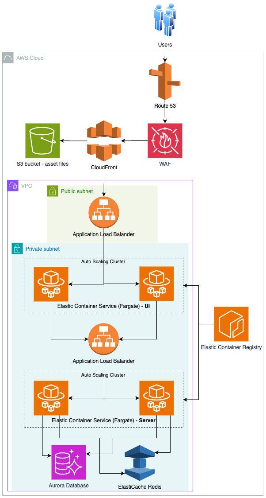

# Car-Migo
Car-migo application is awesome! It will revolutionize the way you get around. It is eco-friendly and helps your pocket.

## Technologies
* Back-end (server)
  * Spring Boot 3.3.4
  * Java 17
  * Maven 3.9.9
  * Redis
  * Docker
  * Git Actions
  * JWT
  * BCrypt
  * Swagger
  * Actuator
  * Checkstyle
* Front-end (ui)
  * React
  * Typescript
  * Javascript
  * Vite
  * Node.js 20
  * Material UI
  * Tanstack
  * Axios
  * Yup
  * Formik
  * Zustand
  * ESLint
  * Jest
  * MSW
* Database
  * Hibernate
  * PostgreSQL
  * H2 Database
  * pgAdmin
  * Flyway


## What is the application?
It is a match-making system for drivers and passengers. You can either advertise rides or query them.

Drivers can create rides (a journey and a timeframe) while passengers can book them.

When inside the car share, you can enjoy the ride and make new friends. Come onboard and experience this new lifestyle.

There are 5 types of users:
* `Staged` users are when a user has created the account but has not confirmed the email yet.
* `Active` users have access to non-admin endpoints.
* `Suspended` users can only access their profiles and update some information.
* `Locked out` users cannot access any endpoints because they had 5 failed attempts to access their accounts.
* `Admin` users can access admin and non-admin endpoints as well as actuator endpoints.
* `Dev` users can access their profiles, update some information and access the actuator endpoints.

## Why?
It is great for the environment once there will be less CO<sub>2</sub> released into the atmosphere.
Moreover, there will be less traffic in our cities thus emergency vehicles will respond to emergencies more rapidly, 
less noise pollution, less road accidents, and you can make new friends to top it off.
The application is not about profiting but about car sharing so the passengers can pay the driver a fair amount for
fuel costs.

## How to run it?
### Requirements
- Docker

From a Linux based terminal, navigate to the root of this project (assuming you have cloned it) and run:
```sh
./run-app.sh
```
This script will create a jar file from Maven package lifecycle using the embedded Maven Wrapper.

The script also creates Docker images and spins the necessary containers:
- `car-migo_ui`: this is the Front-End implementation, the website application.
- `car-migo_server`: the Back-End implementation which holds the business logic.
- `car-migo_postgres`: the application database.
- `car-migo_redis`: the application database cache whose time to live (TTL) is 3 hours.
- `car-migo_flyway`: the database version control.
- `car-migo_pgadmin`: the database client. More details below.

Visit http://localhost:8086/v1/health to ensure the server is running as expected.

There is a heartbeat to verify whether other consumed services are up: http://localhost:8086/v1/heartbeat.

Furthermore, it will automatically open http://localhost:8087/home on your default browser. :tada:

To stop and remove the containers, run:
```sh
docker compose down
```

### pgAdmin
This is the chosen database client.
To interact with it, go to http://localhost:8000/ from your browser to open the pgAdmin 4 UI and enter:
- Email = `admin@car-migo.com`
- Password = `password`

Once inside the pgAdmin 4, click on `Add New Server`. From the dialog box, enter:
- From the `General` tab, give it any name, maybe `car-migo`.
- From the `Connection` tab:
  - Host name/address = `host.docker.internal`
  - Port = `5432`
  - Maintenance database = `postgres`
  - Username = `admin`
  - Password = `password`
- Leave the rest as it is and `Save`.

Then, from the left panel, navigate to Servers > car-migo > Databases > carmigo > Schemas > public > Tables.

This is the Entity Relationship Diagram (ERD) for the application.



### restart.sh
This script restarts the containers. You are also given the option to restart PostgreSQL and pgAdmin volumes.

## Server Login
Send a POST request to http://localhost:8086/v1/login with the following JSON body:
```json
{
  "email": "jake.sully@example.com",
  "password": "Pass1234!"
}
```
Here is the cURL command:
```sh
curl -iL 'http://localhost:8086/v1/login' \
-H 'Content-Type: application/json' \
--data-raw '{
  "email": "jake.sully@example.com",
  "password": "Pass1234!"
}'
```
By the way, Jake Sully is our ADMIN. You can find more users to play with in
[migrations/local-data-seed/V1000.1___local_data_seed.sql](./migrations/local-data-seed/V1000.1___local_data_seed.sql).

Additionally, follow the link to [Postman Collection](.github/assets/Car-Migo.postman_collection.json) which contains
all the application APIs plus some extraadmin endpoints. As well as, these are the
[Postman Environments](.github/assets/Car-Migo-envs.postman_environment.json).

### JWT
The response to the request above will contain a JWT token which you should pass to every subsequent HTTP request as a
Bearer token. For example:
```sh
curl -L 'http://localhost:8086/v1/users/profile' \
-H 'Authorization: Bearer {paste-token-here}'
```

## Swagger UI
OpenApi 3.0 Specification is implemented. Here are the endpoints:
* http://localhost:8086/swagger-ui/index.html
* http://localhost:8086/v3/api-docs
* http://localhost:8086/v3/api-docs.yaml (automatically downloads its yaml file)
* http://localhost:8086/v3/api-docs/swagger-config

Open endpoints, i.e., no credentials needed:
* http://localhost:8086/v1/users/create
* http://localhost:8086/v1/login
* http://localhost:8086/v1/journeys/calculateDistance
* http://localhost:8086/v1/journeys/search

## CI/CD
Git Actions is triggered everytime there is a new code push or a new pull request against the `main` branch.

The script will build the application and run tests using Apache Maven Wrapper and Vitest.
It will also scan the code and produce a security report using CodeQL Analysis.

Git Actions is also scheduled to run once a week: every Monday at 7am UTC.

Also, two Docker images are automatically built, [car-migo_ui](https://hub.docker.com/r/techtinkerer/car-migo_ui) and [car-migo_server](https://hub.docker.com/r/techtinkerer/car-migo_server),  and sent to Docker Hub
repository when the code is merged into the main branch.

Run these to download them:
```sh
docker pull techtinkerer/car-migo_server
docker pull techtinkerer/car-migo_ui
```
And in case you want to run these two (without the database):
```sh
docker run -p 8086:8086 -d techtinkerer/car-migo_server
docker run -p 8087:8087 -d techtinkerer/car-migo_ui
```

## Application Deployment - mock
This is how I would deploy the application to AWS Cloud Services.

Users interact with the application via a web interface (UI). Their requests are routed to the AWS infrastructure.



_Route 53_: This is AWS’s DNS (Domain Name System) service that routes user requests to the appropriate resources.
In this case, it directs the traffic to CloudFront.

_Web Application Firewall_: AWS WAF is a security feature that helps protect the application from common web exploits,
such as SQL injection and Cross-Site Scripting (XSS). It filters out malicious traffic before it reaches CloudFront and
other downstream services.

_AWS CloudFront_: is a Content Delivery Network (CDN) that caches and delivers static and dynamic content to users based
on their geographic location. This improves the speed and reduces the latency of delivering assets such as images, CSS,
and JavaScript files stored in the S3 bucket.

_S3 Bucket (Asset Files)_: AWS S3 is used to store static assets such as images, media, and other static files. These
files are served to users through CloudFront.

_Application Load Balancer_: The ALB distributes incoming traffic across multiple instances of the application running
in Elastic Container Service (ECS). It ensures that no single service is overwhelmed with traffic and improves the
scalability and availability of the application.

_Elastic Container Service (ECS) Fargate (UI)_: This is where the user interface (UI) part of the application is running.
It hosts the frontend of the application in containers, ensuring that the UI is served efficiently to users.

_Elastic Container Service (ECS) Fargate (Server)_: This is the backend or server side of the application, where
business logic, API calls, and other server-side processing occur.

_Elastic Container Registry (ECR)_:This is where the application’s container images (both UI and Server) are stored.
The ECS services pull these container images from ECR to deploy the latest versions of the application.

_Aurora Database_ & _ElastiCache Redis_: AWS Aurora is a managed relational database while ElasticCache is the Cache service. Both of these work together to enhance the application’s performance and reliability to efficiently manage data while maintaining high performance and availability.
The application’s backend (server) interacts with the Aurora database to perform read and write operations related to user data and transactions and with ElastiCache to cache frequently accessed data, reducing the load on Aurora and providing faster response times for users.
